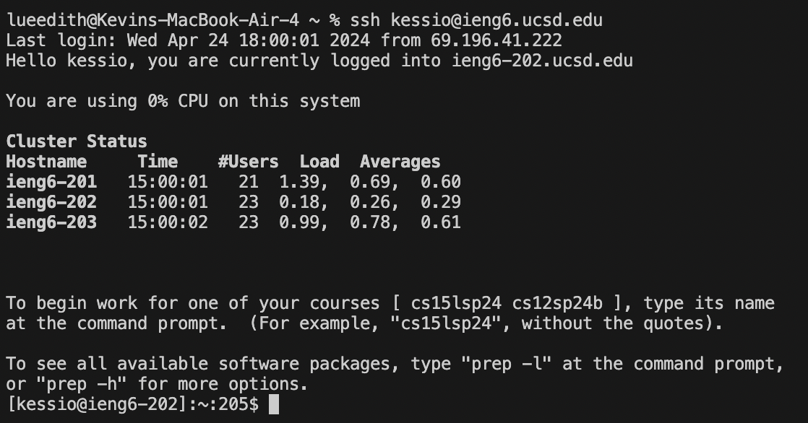
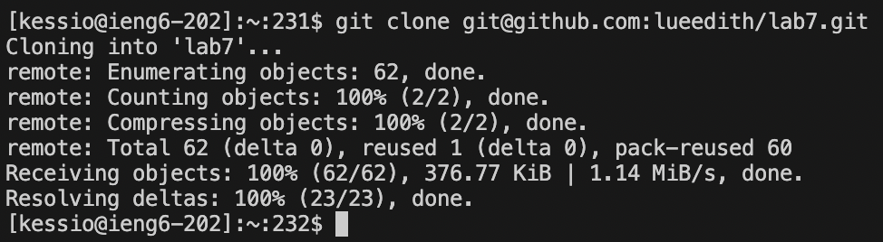
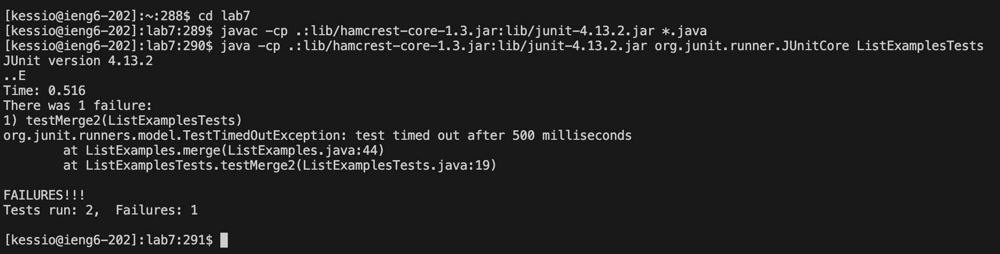
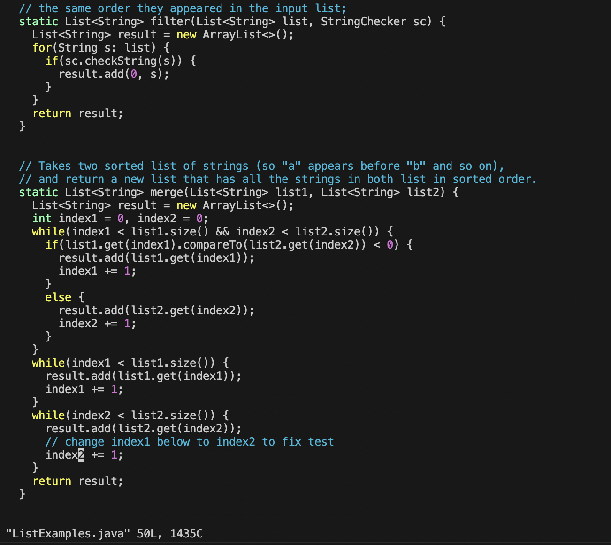
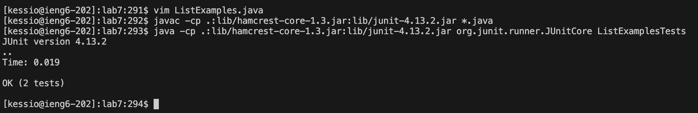
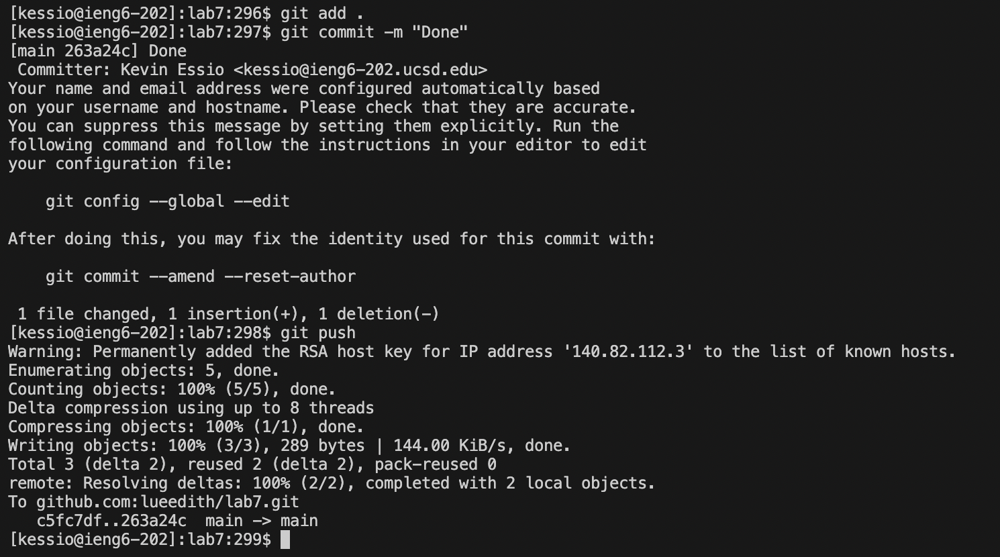

# Lab Report 4

Kevin E (12 Keypresses) : (Starting from first character of first line) 43j e x i 2 <ESC> :wq <ENTER>

> Step 4

KeyPresses: ssh <SPACE> kessio@ieng6@ucsd.edu <ENTER>

This command allows me to ssh into my ieng6 server.

> Step 5

KeyPresses: git <SPACE> clone <SPACE> <CMD+C> <CMD+V> <ENTER>

I now clone the respository I forked previously into my ieng6 server by using `git clone` and copy pasting the ssh url of the repository.

> Step 6

KeyPresses: cd <SPACE> lab7 <ENTER> <CMD+C> <CMD+V> <ENTER> <CMD+C> <CMD+V> L <TAB> T <TAB> <BACKSPACE> <ENTER>

Here I am changing the terminal direcotry to the lab7 directory to continue the tasks. I then copy paste the commands to compile and run the Junit tests, which are included in the lab7 git page. We see that one test fails.

> Step 7

KeyPresses: vim <SPACE> L <TAB> .java <ENTER> 43j e x i 2 <ESC> :wq <ENTER>

Using `vim`, we open and edit the ListExamples.java file to fix the bug, which is changing `index1`to `index2`. We then use `:wq` to save the changes to the file and exit.

> Step 8

KeyPresses: <CMD+C> <CMD+V> <ENTER> <CMD+C> <CMD+V> L <TAB> T <TAB> <BACKSPACE> <ENTER>

We re-run the tests to esnure that our change was effective. We see that there were no failiures.

> Step 9

KeyPresses: git <SPACE> add <SPACE> . <ENTER> git <SPACE> commit <SPACE> -m <SPACE> "Done" <ENTER> git <SPACE> push <ENTER>

We commit the changes made, then push them to our forked repository. 

