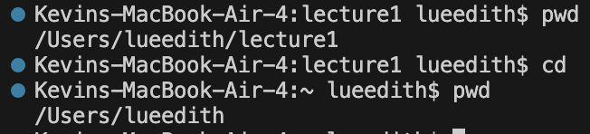
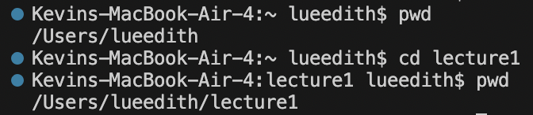
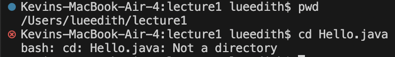
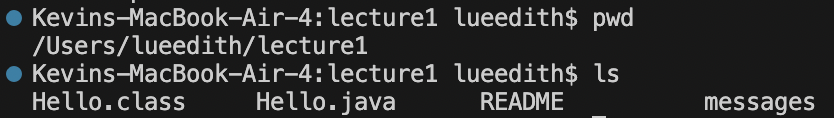
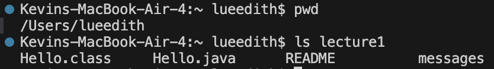
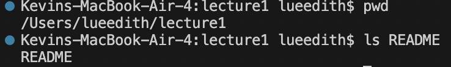
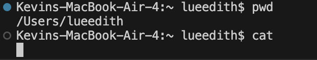
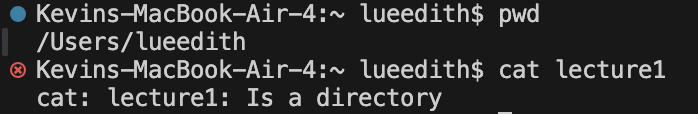
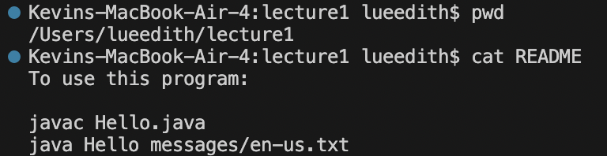

1 cd ran with No Arguments

  
  
  Output: (No visual output, but it changes the working directory to the user's home directory)
  
  Explanation: Running cd with no arguments defaults to changing the working directory to the user's home directory.
  
  Error: No
  
2 cd ran with Path to a Directory

  
  
  Output: (No visual output, directory changes to specified path)
  
  Explanation: The command changes the working directory to the specified path.
  
  Error: No
  
3. cd ran with Path to a File (Error)

  
  
  Output: bash: cd: Hello.java: Not a directory
  
  Explanation: The cd command is used to change directories, not to open files. Hello.java is a java file not a directory, thus is an error.
  
  Error: Yes
  
4. ls ran with No Arguments

  
  
  Output: Hello.class Hello.java README messages
  
  Explanation: Displays the contents of the current directory, in this case the contents of lecture1 directory.
  
  Error: No

5. ls ran with Path to a Directory

  
  
  Output: Hello.class Hello.java README messages
  
  Explanation: Lists the contents of the lecture1 directory, showing three files and one directory.
  
  Error: No

6. ls ran with Path to a File

  
  
  Output: README
  
  Explanation: Lists the specified file, confirming its presence in the directory.
  
  Error: No

7. cat ran with No Arguments

  
  
  Output: Waits for input from the user. Anything typed is echoed back to the terminal.
  
  Explanation: When cat is run without any arguments, it reads from standard input (stdin). The terminal will wait for an input and echo it as the output. This command can be used to create text files this way.
  
  Error: No

8. cat ran with Path to a Directory (Error)

  
  
  Output: cat: lecture1: Is a directory
  
  Explanation: The cat command is intended for displaying file contents, not directory contents. lecture1 is a directory thus producing error.
  
  Error: Yes

9. cat ran with Path to a File

  
  
  Output: The contents of the README file.
  
  Explanation: The cat commmand ran with a file as an argument displays the contesnts of the file.
  
  Error: No
  
