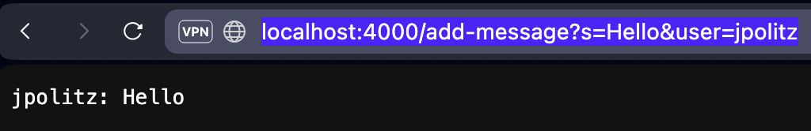
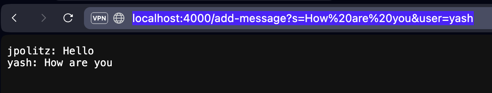
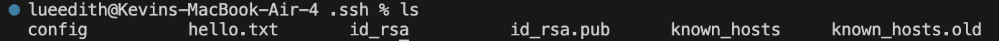
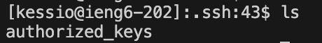
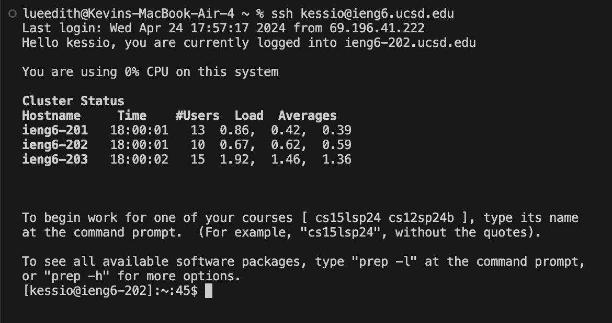

> Part 1:

Code for `ChatServer`:

```
import java.io.IOException;
import java.net.URI;
import java.util.ArrayList;

class Handler implements URLHandler {
    ArrayList<String> chatMessages = new ArrayList<>();

    public String handleRequest(URI url) {
        if (url.getPath().equals("/add-message") && url.getQuery() != null) {
            String[] params = url.getQuery().split("&");
            String user = null;
            String message = null;

            for (String param : params) {
                if (param.startsWith("user=")) {
                    user = param.substring(5);
                } else if (param.startsWith("s=")) {
                    message = param.substring(2);
                }
            }

            if (user != null && message != null) {
                chatMessages.add(user + ": " + message);
                return String.join("\n", chatMessages);
            } else {
                return "Invalid request. Missing user or message.";
            }
        }
        return "404 Not Found";
    }
}

class ChatServer {
    public static void main(String[] args) throws IOException {
        if(args.length == 0){
            System.out.println("Missing port number! Try any number between 1024 to 49151");
            return;
        }

        int port = Integer.parseInt(args[0]);

        Server.start(port, new Handler());
    }
}
```

First usage of `/add-message`



- The one and only method called is `handleRequest(URI url)`
  
- The argument for this method is `URI url`
- The only relavent field value is `ArrayList<String> chatMessages` which starts off as an empty (`[]`)

- `chatMessages` is empty before the request, and contains `["jpolitz: Hello"]` after the request.
- The method processes the URL splitting the query string `s=Hello&user=jpolitz` into two parameters. The method identifies the `user` and `s` values, constructing the string `"jpolitz: Hello"`. This message is then added to the `chatMessages` ArrayList.
- Current state of `chatMessages` is returned, at this point being `"jpolitz: Hello"`


Second usage of `/add-message`



- The one and only method called is `handleRequest(URI url)`
  
- The argument for this method is `URI url`
- The only relavent field value is `ArrayList<String> chatMessages` which cointains (`["jpolitz: Hello"]`) from the first command ran.

- `chatMessages` contains `["jpolitz: Hello]` before the request, and contains `["jpolitz: Hello", "yash: How are you"]` after the request.
- The method processes the URL splitting the query string `s=How are you&user=yash` into two parameters. The method identifies the `user` and `s` values, constructing the string `"yash: How are you"`. This message is then added to the `chatMessages` ArrayList.
- Current state of `chatMessages` is returned, at this point being:
```
"jpolitz: Hello"
"yash: How are you:
```

> Part 2







> Part 3

I had no idea that you could start and run a server using only the terminal. This opened my eyes to the possibiliteis of not just the terminal but also java programming in writing the code for a server.
