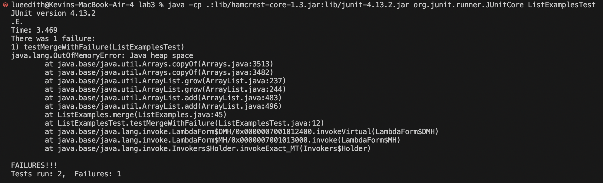

# Lab Report 3

> Part 1, Bugs:

A failure-inducing input for the buggy program, as a JUnit test and any associated code (write it as a code block in Markdown):

```
@Test
      public void testMergeWithFailure() {
          List<String> list1 = Arrays.asList("a", "c");
          List<String> list2 = Arrays.asList("b", "d", "e", "f");
          List<String> expected = Arrays.asList("a", "b", "c", "d", "e", "f");
          List<String> result = ListExamples.merge(list1, list2);
          assertEquals("Should merge both lists into a sorted order", expected, result);
      }
```

An input that doesn't induce a failure, as a JUnit test and any associated code (write it as a code block in Markdown).

```
@Test
      public void testMergeWithoutFailure() {
          List<String> list1 = Arrays.asList("a", "c", "e");
          List<String> list2 = Arrays.asList("b", "d");
          List<String> expected = Arrays.asList("a", "b", "c", "d", "e");
          List<String> result = ListExamples.merge(list1, list2);
          assertEquals("Should merge both lists into a sorted order", expected, result);
      }
```

The symptom, as the output of running the two tests above (provide it as a screenshot -- one test should pass, one test should fail).



The bug, as the before-and-after code change required to fix it (as two code blocks in Markdown).

Before:
```
while(index2 < list2.size()) {
  result.add(list2.get(index2));
  index1 += 1;
}
return result;
```
After:
```
while(index2 < list2.size()) {
  result.add(list2.get(index2));
  index2 += 1;
}
return result;
```

Briefly describe (2-3 sentences) why the fix addresses the issue.
***
Changing the incriment from `index1` to `index2` ensures the loop is able to reach the elements in `list2`. This change ensures the loop does not go into an infinite loop, properly advancing through `list2`.

> Part 2, Researching Commands:
> All info found from https://www.geeksforgeeks.org/grep-command-in-unixlinux/

`grep` used with `-i`

`grep -i "the" technical/911report/chapter-1.txt > grep-results.txt` 

`grep -i "HELLO" technical/911report/chapter-1.txt > grep-results.txt`

In using `-i` in the above examples, there is no output (output moved into specified text file), as it would flood the terminal, but this command uses `grep` with the string provided while ignoring case, for example it will work on "The" and "THE".  This is useful for searching for a word when not caring for case, this way the user does not need to input several grep commands.

`grep` used with `-c`

`grep -c "the" technical/911report/chapter-1.txt` 
Output `313`

`grep -c "well" technical/911report/chapter-1.txt`
Output `6`

Using `-c` returns the number of lines where the pattern is identified. This can be helpful to retrieve an important statistic or piece of data without having to use multiple steps and other commands.

`grep` used with `-n`

`grep -n "well" technical/911report/chapter-1.txt`
Output:
```
104:    The hijackers attacked sometime between 8:42 and 8:46. They used knives (as reported by two passengers and a flight attendant), Mace (reported by one passenger), and the threat of a bomb (reported by the same passenger). They stabbed members of the flight crew (reported by a flight attendant and one passenger). Both pilots had been killed (reported by one flight attendant). The eyewitness accounts came from calls made from the rear of the plane, from passengers originally seated further forward in the cabin, a sign that passengers and perhaps crew had been moved to the back of the aircraft. Given similarities to American 11 in hijacker seating and in eyewitness reports of tactics and weapons, as well as the contact between the presumed team leaders, Atta and Shehhi, we believe the tactics were similar on both flights.
146:    All on board, as well as many civilian and military personnel in the building, were killed.
164:    The airlines bore responsibility, too. They were facing an escalating number of conflicting and, for the most part, erroneous reports about other flights, as well as a continuing lack of vital information from the FAA about the hijacked flights. We found no evidence, however, that American Airlines sent any cockpit warnings to its aircraft on 9/11. United's first decisive action to notify its airborne aircraft to take defensive action did not come until 9:19, when a United flight dispatcher, Ed Ballinger, took the initiative to begin transmitting warnings to his 16 transcontinental flights: "Beware any cockpit intrusion- Two a/c [aircraft] hit World Trade Center." One of the flights that received the warning was United 93. Because Ballinger was still responsible for his other flights as well as Flight 175, his warning message was not transmitted to Flight 93 until 9:23.
398:    The reasons are technical, arising from the way the software processed radar information, as well as from poor primary radar coverage where American 77 was flying.
462:    FAA headquarters had by this time established an open line of communication with the Command Center at Herndon and instructed it to poll all its centers about suspect aircraft. The Command Center executed the request and, a minute later, Cleveland Center reported that "United 93 may have a bomb on board." At 9:34, the Command Center relayed the information concerning United 93 to FAA headquarters. At approximately 9:36, Cleveland advised the Command Center that it was still tracking United 93 and specifically inquired whether someone had requested the military to launch fighter aircraft to intercept the aircraft. Cleveland even told the Command Center it was prepared to contact a nearby military base to make the request. The Command Center told Cleveland that FAA personnel well above them in the chain of command had to make the decision to seek military assistance and were working on the issue.
544:    In their testimony and in other public accounts, NORAD officials also stated that the Langley fighters were scrambled to respond to the notifications about American 77,178 United 93, or both. These statements were incorrect as well. The fighters were scrambled because of the report that American 11 was heading south, as is clear not just from taped conversations at NEADS but also from taped conversations at FAA centers; contemporaneous logs compiled at NEADS, Continental Region headquarters, and NORAD; and other records. Yet this response to a phantom aircraft was not recounted in a single public timeline or statement issued by the FAA or Department of Defense. The inaccurate accounts created the impression that the Langley scramble was a logical response to an actual hijacked aircraft.
```
`grep -n "minor" technical/911report/chapter-1.txt`
Output:
```
84:    Sweeney calmly reported on her line that the plane had been hijacked; a man in first class had his throat slashed; two flight attendants had been stabbed-one was seriously hurt and was on oxygen while the other's wounds seemed minor; a doctor had been requested; the flight attendants were unable to contact the cockpit; and there was a bomb in the cockpit. Sweeney told Woodward that she and Ong were trying to relay as much information as they could to people on the ground.
618:    The President's motorcade departed at 9:35, and arrived at the airport between 9:42 and 9:45. During the ride the President learned about the attack on the Pentagon. He boarded the aircraft, asked the Secret Service about the safety of his family, and called the Vice President. According to notes of the call, at about 9:45 the President told the Vice President:"Sounds like we have a minor war going on here, I heard about the Pentagon. We're at war . . . somebody's going to pay."
```
Using `-n` can be extremely useful for finding the context of where a word or pattern appers in a text, in this case "well" and "minor". The option outputs the line and line number where the pattern was located.

`grep` used with `-v`

`grep -v "the" technical/911report/chapter-1.txt > grep-output.txt`

`grep -v "hello" technical/911report/chapter-1.txt > grep-output.txt`

In using `-v` in the above examples there is no output (moved to specified file), as it floods the terminal, however the command searches for the lines that dont contain the provided pattern, in this case the lines containing "the" and "hello". This can be useful if the user desires lines not involving a certain element.
